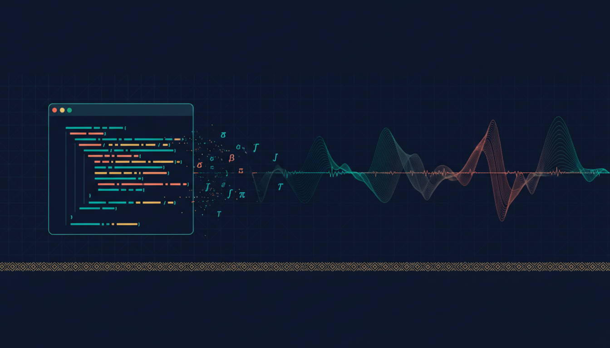

  

<!-- Animated typing intro -->

  

<!-- Visitor counter & social badges -->

  
  &nbsp;
  
  &nbsp;
  

 

<!-- About Me -->
<h2 align="center">
   About Me
</h2>

<table>
<tr>
<td width="55%">

I'm **Muhammad Hafiz bin Ismail**, a **Statistics (Diploma) graduate** from Malaysia passionate about turning data into actionable insights and building things that help people.

**What I do:**
- Time series forecasting & statistical analysis (ARIMA, descriptive stats, inference)
- Building **Minecraft plugins** with Java (Bukkit/Spigot/Paper)
- Developing web tools that make learning easier — check out [**aremath.com**](https://aremath.com) ✨
- Clean, documented, reproducible data workflows in **R** and **Python**

**Currently focused on:**
- Sharpening my forecasting & data storytelling skills
- Leveling up my code architecture (from 2018 Java kid to clean, professional repos)
- Building tools that actually help Malaysian students

</td>
<td width="45%" align="center">

<!-- GitHub Stats Card -->

  

<!-- Top Languages -->

</td>
</tr>
</table>

 

<!-- Tech Stack -->
<h2 align="center">Tech Stack</h2>

**Languages**
  

  

**Tools & Frameworks**
  

  

**Stats & Data**
  

 

<!-- Featured Projects -->
<h2 align="center">
  Featured Projects
</h2>

<table>
<tr>
<td width="33%" valign="top">

<h3 align="center">
  
</h3>

  
  

A website built to help Malaysian SPM students learn Additional Mathematics better. Interactive, focused, and made with actual students in mind.

  <a href="https://aremath.com" target="_blank"><b>Live Site →</b></a>

</td>
<td width="33%" valign="top">

<h3 align="center">
  
</h3>

  
  

A Python project focused on mathematical computing and statistical exploration. Clean code, documented steps, reproducible results.

  <a href="https://github.com/hafiz122/polymath"><b>View Code →</b></a>

</td>
<td width="33%" valign="top">

<h3 align="center">
  
</h3>

  
  

A practical web tool for Malaysian Muslims to check prayer times. Simple, fast, and made for daily use.

  <a href="https://github.com/hafiz122/waktu-solat"><b>View Code →</b></a>

</td>
</tr>
</table>

 

<!-- Minecraft Plugins Section -->
<h2 align="center">
   
  Minecraft Plugins
</h2>

I started coding Minecraft plugins when I was 13 and it's still something I love doing. Here's a collection of my Spigot/Bukkit work:

  

| Plugin | Description | Language |
|--------|-------------|----------|
| [**Coffee**](https://github.com/hafiz122/Coffee) | A cozy coffee plugin for your Minecraft server ☕ | Java |
| [**RabbitRPG**](https://github.com/hafiz122/RabbitRPG) | Custom plugin made for the RabbitRPG experience 🐰 | Java |
| [**Clear-Chat**](https://github.com/hafiz122/Clear-Chat) | Simple, effective chat clearing for server admins 🧹 | Java |
| [**Tanah Kubur**](https://github.com/hafiz122/tanah-kubur) | When you die, a chest spawns (if you have one in inventory) ⚰️ | Java |

 

<i>My older repos (2018 era) show my learning journey — the ideas and structure were solid for a 13-year-old! My newer work is much more polished. Check out the recent stuff first.</i>

 

<!-- Activity Graph -->
<h2 align="center">Contribution Activity</h2>

  

 

<!-- Achievements & Trophies -->
<h2 align="center">GitHub Trophies</h2>

  

 

<!-- Streak Stats -->

  

 

<!-- Footer -->

---

 

*Made with care from Malaysia* 🇲🇾

 

&nbsp;

&nbsp;

